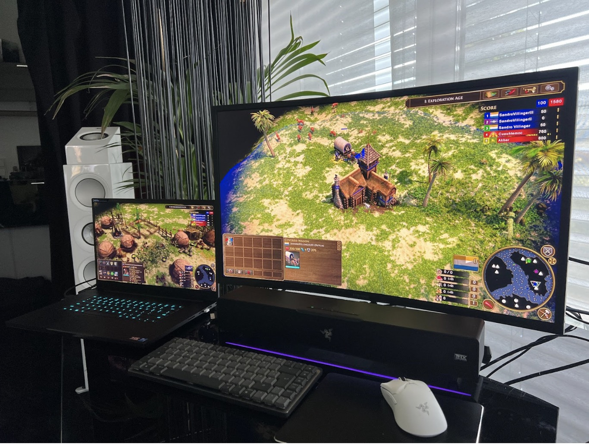
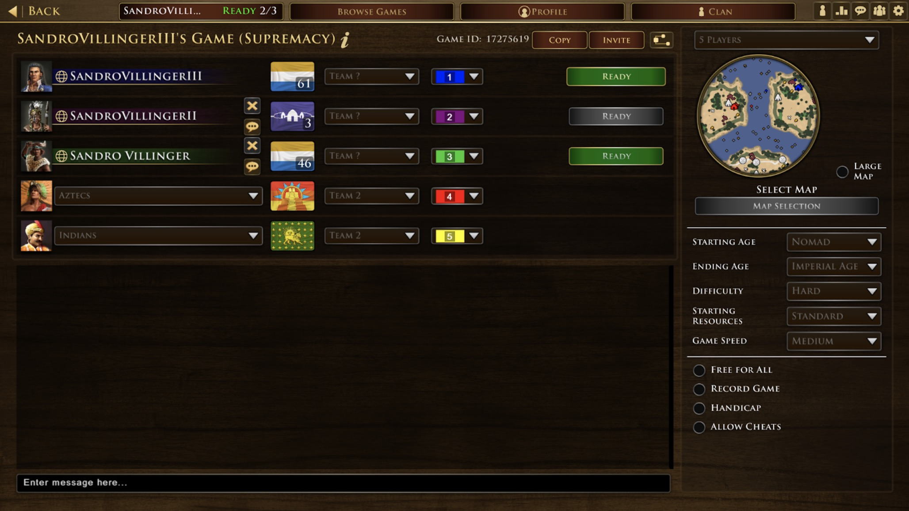
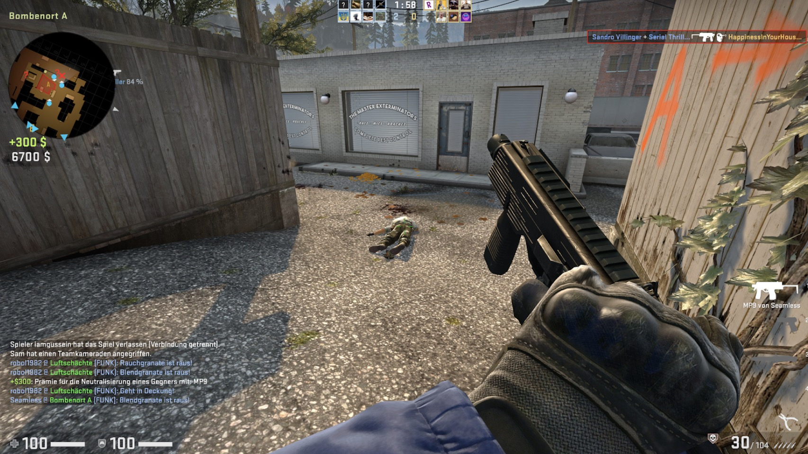

Multiplayer games rank among the most fun, immersive, and financially successful gameplay experiences in the industry. From a gamer’s perspective, playing these needs to be simple: A player sends a game invite on Steam, Epic, or any other platform, then finds a lobby and connects to a multiplayer session. These range from the sprawling Fortnite Chaos to the simpler story-driven co-op sessions of Dying Light 2.
If you’re a game developer, getting such simplicity to work reliably, at low latency, and with security in mind, poses a massive challenge.
Developers need to understand what is happening behind the scenes and lines of code to make multiplayer work, and how to implement a reliable multiplayer architecture that’s devoid of cheaters.

## What is Game Networking?

Game networking is a key part of developing any game with multiplayer functionality. At its core, it describes the process of sending input and player information from one client in a multiplayer game to the server, or another client. Keeping this information synchronized so that two or more players can play with, or against each other, is the challenge.

The complexities of implementing game networking can be daunting, as it requires game developers to master transport protocols, manage bandwidth issues, prevent cheating, and ensure proper encryption while thinking about latency when implementing all these techniques.

## ​​Why Should Game Programmers Know about Game Networking?

Multiplayer games are more than just an add-on to an existing game. In most cases, they are the game, or at least a strong, unique selling point. For example, if GTA V, the most successful entertainment product on the planet, had just been a single-player experience back in 2013, it probably would have been popular for a year or two. Its sales stand at more than 165 million units so far, and GTA Online, its multiplayer component, is maintaining 5 million per quarter. In other words, Online can turn your next gaming project into a long-term commercial success.

Another important reason to know about multiplayer development is that it is a key requirement for a gaming developer for a role at many major studios. Knowing the basics is essential to be considered for your next job in the industry.

## How Did Multiplayer Gaming Become Such a Success?

Long before we had incredible successes such as GTA Online, Fortnite or Destiny, gamers had a desire to play both cooperatively and against each other. Multiplayer games started in the 50’s, albeit on one tiny screen and computers that were the size of storage rooms.

In the 90’s, multiplayer grew from being a couch co-op experience to a network and online experience, thanks to the evolution of mainstream PC LANs and early dial-up connections. Today single-player games are still successful, and the multiplayer segment is growing significantly.

## Game Networking Models - a Primer

Networking games are sciences on their own. They are usually implemented independently from the actual game development, so it doesn’t matter what game engine uses online implementation. There are two basic game server models which are widely popular: Peer-to-peer (P2P) networking, and client-server networking.

### What is P2P Networking?

This model directly connects two or more players either locally, meaning offline, via their LAN or through the web, *directly to each other* in a decentralized fashion.

The benefits of peer-to-peer (P2P) look attractive at first glance. There is no server involved as all PCs have equal authority. The load is balanced across all connected PCs leading to an uplift in performance because there’s no server in-between that could be overburdened. Additionally, since servers introduce an additional step between two clients, latency in P2P is typically lower.

On the downside, security remains an issue because individual clients pose a threat to each other, and there’s cheating. It’s important to look into server-side control and potential anti-cheating algorithms (more on that below).

Widely used in the 90’s and 00’s, P2P remains popular, although a lot of P2P games have switched to a hybrid model, which uses servers for authentication and allows players to directly connect. Probably the most popular example of such a game is GTA Online. Other well-known P2P games include:

- Super Smash Bros. Ultimate
- For Honor
- Demon’s Souls
- The Dark Souls series
- For Honor
- Warframe

### What is Client-Server Networking?

While more costly from an infrastructure perspective, many modern online games host their own multiplayer servers using a client-server networking model. All players are connected to one, or multiple, servers hosting the game. Client-server networking is the de-facto standard in modern networking games, and most studios are moving to this model.

From an engineering perspective, it is easier to implement because P2P requires the development of many fail-save implementations. Client-server also helps prevent cheating because the server is always right.

For instance, the server determines whether a player owns a certain weapon or is located at a specific position on the map - the client has no chance to interfere. If the client suddenly shows the player owning a more powerful weapon than the last one registered, the server overrides this state and could potentially flag it as a cheat. Popular games that run on a server-client model include:

- Roblox
- Ghost of Tushima Legends
- Overwatch
- Fortnite
- Minecraft
- Rocket League

## Getting Data From Point A to B – Choosing the Transport Protocol

In a client-server model, game developers can go a few different routes when implementing multiplayer: For one, you can use the traditional and well-known Transmission Control Protocol (TCP) and User Datagram Protocol (UDP) protocols. You can also build your own network libraries, or use existing network libraries, which might include everything you need to get started.

These are the protocols you need to know about:

**TCP**: This classic source-to-destination packet transmission technique is tried and true. However, its transmission size is limited, making it difficult for game developers to guarantee a low-latency game experience. This is likely to be the nail in the coffin as even slower RTS games like Age of Empires III Definitive Edition suffer heavily when relying on TCP. This is not an issue, however, if you’re just developing a turn-by-turn game that does not require instant reaction or focus on a direct LAN connection over the game's home network, which offers near-perfect throughput and latency.

*Slower games like Age of Empires III Definitive Edition can suffer from latency issues, which is why UDP is the better choice over TCP in most cases.*

**UDP**: UDP sits on top of TCP and offers a few more advantages such as error correction and significantly better performance. It is the protocol of choice for services such as video conferencing, streaming, VoIP and multiplayer game programming and networking. UDP offers lower latency than TCP because it irons out some of TCP’s inherent weaknesses. For instance, it can transfer multiple parallel streams, so a lost data package is not the end of the world, while latency remains low.

Since TCP is far better at making sure a package gets received, and UDP offers lower latency and higher bandwidth, you might find yourself in a hybrid situation where you use TCP for certain in-game features like chat, and UDP for the actual networking game itself.

As a game developer, certain requirements lead you down the path of creating your own custom-made UDP protocol. To get started building your own protocol, use the primary authority on network programming: [Gaffer On Games](https://gafferongames.com/). If you’re new to the topic, another good read is [Networking and Online Games: Understanding and Engineering Multiplayer Internet Game](https://www.amazon.com/Networking-Online-Games-Understanding-Engineering/dp/0470018577) by Philip Branch, Mark Claypool and Grenville Armitage.

## The Easy Way Out: Pre-Built Network Protocols

Instead of building the UDP library yourself, many open-source libraries already include features you need such as:

- **(D)DoS mitigation** to prevent a client or multiple clients from flooding your server with TCP or UDP packets
- **Heartbeat to ensure** the client or the server is still up and performing
- **Round-Trip Time (RTT) estimations** to determine how long the transmission usually takes

These libraries usually support multiple platforms and are used in existing game engines. One great example is the low-level UDP protocol [Laminar](https://github.com/TimonPost/laminar), or the open-source library [SLikeNet](https://github.com/SLikeSoft/SLikeNet), which is a fork of the now-defunct, but highly mature, Raknet networking engine. Even Valve, the maker of the popular gaming platform Steam, offers its own UDP protocol called [GameNetworkingSockets](https://github.com/ValveSoftware/GameNetworkingSockets), which comes with sophisticated NAT travel (highly critical since most users sit behind a router and aren’t directly connected to the internet), encryption and a [reliability](https://gafferongames.com/post/reliable_ordered_messages/) layer.

The [ENet: ENet (bespin.org)](http://enet.bespin.org/) library is a great way for your game to connect from computer to server. To learn how to use ENet, this [YouTube tutorial](https://www.youtube.com/watch?v=ZOi-R_JjEqw) is a great starting point.

**Bottom line**: Whether you choose to implement your own protocol or go with a 3rd party library, make sure that it is not directly implemented in your game but is isolated from the engine or your games library.

## Best Practices, Encoding Techniques and Algorithms

Once you’ve chosen a protocol or library, the next step is to implement basic techniques for sending and receiving the actual game and player data.

You need to understand most of these algorithms and techniques to improve the overall robustness of your game and ensure that the multiplayer experience continues to perform well on slower Wi-Fi connections and mobile hotspots.

1. Use Encryption for anti-cheat and authentication purposes

   With cheating being the top concern of many gamers, you need to implement a solid encryption strategy between client and server. This makes it much harder for cheaters to intercept and change packets and abuse them for their own purposes.

   This also helps you uniquely identify a player in an online session and prevent the user's data from being intercepted.

1. Use compression to get higher bandwidth

   To improve latency and improve throughput, implement additional compression techniques.

   - **Bound and quantization**: This lossy compression technique sends only the essential game state pieces.

   - **Selective and variable updating**: Another mechanism to save bandwidth is by not sending the data at all. Your network algorithm should distinguish between information that is relevant for the player-server communication, and information that’s not needed at the moment. For instance, data that signal changes in the weapon a player is using should not include data on other weapons that remain unchanged.

   - **Bit packing**: Bit packing is a compression principle that uses as few bits as possible to store data by removing unnecessary bits. This article goes into actual C# implementation examples: [Data Compression: Bit-Packing 101 — KinematicSoup Technologies Inc](https://www.kinematicsoup.com/news/2016/9/6/data-compression-bit-packing-101).

1. Safely store and transmit data using Serialization

   This popular method helps turn any data type or object of your game into a stream of bytes that can be encoded, sent, and decoded on the server side, and vice versa. Both the server and client side need to mirror the methods used. This is handled by your programming language or libraries. Be sure to read about the [Connected Adaptive Networked Physics](https://theses.fh-hagenberg.at/system/files/pdf/Herrmann16.pdf) framework thesis which dives deeper into several techniques to automate a highly efficient multiplayer stack.

1. How to fight cheaters: Anti-cheat techniques

   As mentioned before, cheating remains the biggest frustration among players. One of the key principles you need to implement in your game is first and foremost a server authority. This ensures that player movement and inventory are controlled only by the server and not by the client.

   Second, when using the server authority principle, you need to set a few ground rules:

   - **Aimbot detection**: An aimbot helps gamers perfectly aim a shot at other players. On the server side, this is detected by comparing the extremely high hit rates of one client versus the average of the rest. A great source to get started with the basics is this [research paper](https://www.eecis.udel.edu/~hnw/paper/dsn17a.pdf) covering the "AimDetect" detector.

   

   - **Don’t send unnecessary data to the client**: When developing a multiplayer game, you are likely to start by sending server data of all players to all clients. For instance, player A will get the position of player B. This makes sense when player B is in the immediate vicinity of player A, but it does not make sense to send all this data when B is far away.

Learn more about potential ways to detect and solve the never-ending cheat problem by reading [Anti-Cheat for MMOs issues and solutions? - Game Development Stack Exchange](https://gamedev.stackexchange.com/questions/1520/anti-cheat-for-mmos-issues-and-solutions) and [How to hack an MMO – Raph's Website (raphkoster.com)](https://www.raphkoster.com/2008/04/17/how-to-hack-an-mmo/).

## Conclusion

Multiplayer games are engaging, and immersive, represent significant revenue growth for the gaming industry, and game networking is a fundamental component of developing any game with multiplayer functionality. Developers who want to play in this space need to familiarize themselves with transport protocols, security methodologies, bandwidth issues, and other requirements to take advantage of the growing trend toward multiplayer games. You can learn more about Linux game development on Linode’s [resource center](/docs/resources/).
